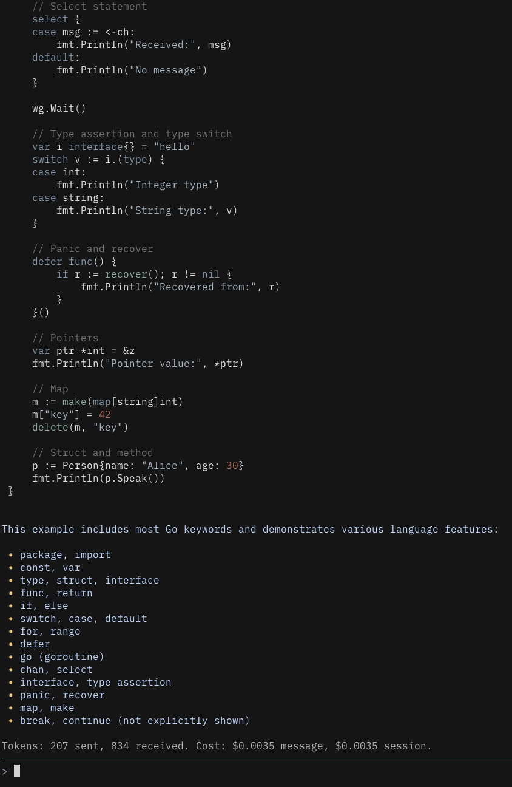

# Aider



To use in Aider the same Python interpreter must be used which is handled in provided `Makefile`.

- Install
```sh
$ make install
```

- Check installation
```sh
$ make check
```

- Uninstall
```sh
$ make uninstall
```

- Use in aider:
```yaml
# .aider.conf.yml
code-theme: no-clown-fiesta

# no-clown-fiesta colors for output as example
user-input-color: '#88afa2'
tool-output-color: '#AFAFAF'
tool-error-color: '#984936'
tool-warning-color: '#ab8550'
assistant-output-color: '#BAD7FF'
completion-menu-color: '#E1E1E1'
completion-menu-bg-color: '#202020'
completion-menu-current-color: '#151515'
completion-menu-current-bg-color: '#BAD7FF'
```

